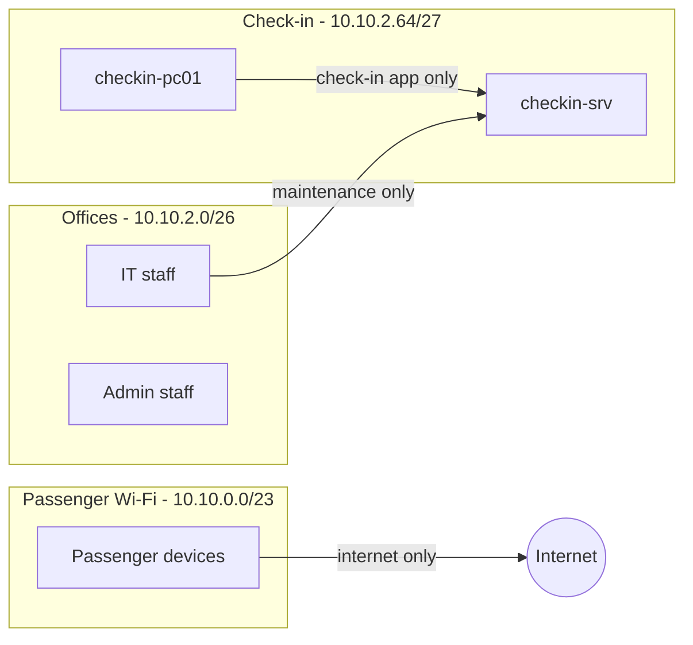

# Chapter 1 – Network Design

> How the Monteverde Airport network is divided into zones, which zones may talk to each other, and how IP addresses are assigned.

**Status:** Designed on paper – the check-in zone will be built first (lab v0.1)

---

## Design principle: segmentation

An airport is already divided into physical zones: the public area that anyone can enter, security checkpoints, the boarding area reserved for passengers with a boarding pass, and staff-only areas.

The network follows the same logic. It is split into **separate zones with rules on who can talk to whom**. If an attacker compromises one zone, they stay contained there instead of moving freely across the whole airport.

## Network zones

| Zone | Who is inside | Trust level |
|---|---|---|
| **Passenger Wi-Fi** | Phones and laptops of anyone in the terminal | None – treated like the open internet |
| **Check-in** | Check-in server and check-in desk workstations | High – core of airport operations |
| **Offices** | Administrative and IT staff workstations | Medium |

## Traffic rules

| From → To | Allowed? | Why |
|---|---|---|
| Passenger Wi-Fi → Internet | Yes | Passengers only need internet access |
| Passenger Wi-Fi → any internal zone | No | Untrusted devices must never reach airport systems |
| Check-in desks → check-in server | Only the check-in application | Operators need the app, nothing else |
| IT staff → check-in server | Only for maintenance | Administration limited to IT personnel |
| Admin staff → check-in zone | No | No business need |

Guiding rule: **everything is blocked unless there is a clear reason to allow it** (default deny).

## IP addressing plan (VLSM)

Address space: **10.10.0.0/16** (private range). Subnets are assigned starting from the largest zone.

| Zone | Network | Subnet mask | First usable | Last usable | Broadcast | Max hosts |
|---|---|---|---|---|---|---|
| Passenger Wi-Fi | 10.10.0.0/23 | 255.255.254.0 | 10.10.0.1 | 10.10.1.254 | 10.10.1.255 | 510 |
| Offices | 10.10.2.0/26 | 255.255.255.192 | 10.10.2.1 | 10.10.2.62 | 10.10.2.63 | 62 |
| Check-in | 10.10.2.64/27 | 255.255.255.224 | 10.10.2.65 | 10.10.2.94 | 10.10.2.95 | 30 |

**How the masks were chosen** (usable hosts = 2^(32 − prefix) − 2):

- Passenger Wi-Fi needs **400** hosts → /24 gives 254 (too few), /23 gives **510**
- Offices need **50** hosts → /27 gives 30 (too few), /26 gives **62**
- Check-in needs **20** hosts → /27 gives **30**

Addresses from **10.10.2.96** onward are reserved for future zones (SOC, servers, baggage handling).

### Check-in zone – address assignments

| Address | Device | Assignment |
|---|---|---|
| 10.10.2.65 | Gateway (future firewall) | Static |
| 10.10.2.66 | `checkin-srv` | Static – workstations must always find it at the same address |
| 10.10.2.80 – 10.10.2.94 | Check-in desk workstations (incl. `checkin-pc01`) | Workstation range |

## Design decision: VLSM vs. one /24 per zone

VLSM uses addresses efficiently. In real enterprise networks with a large private space such as 10.0.0.0/8, many teams prefer to give **each zone a full /24** (for example 10.10.20.0/24 for check-in), even if it wastes addresses, because the zone can be recognized from the address at a glance.

For this lab I used VLSM to apply the subnetting techniques from my course. In a production design, readability would be a strong argument for the /24-per-zone approach.
