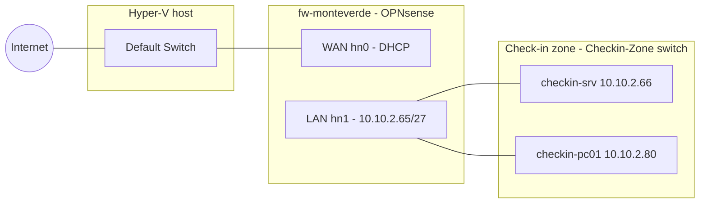
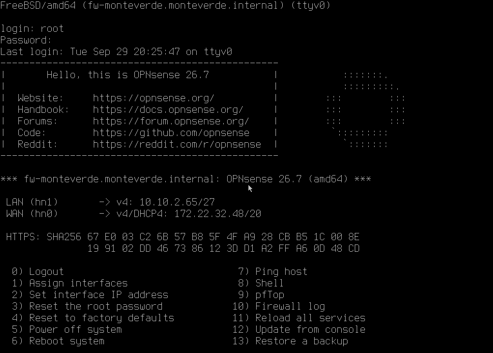
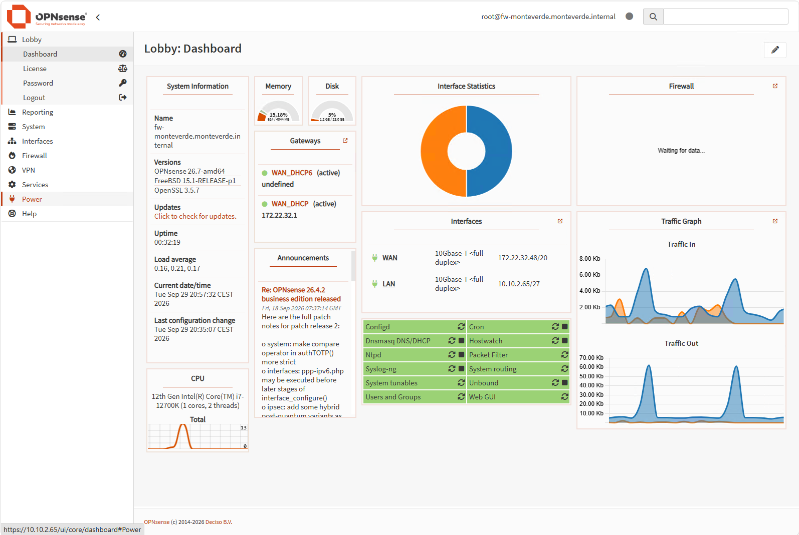
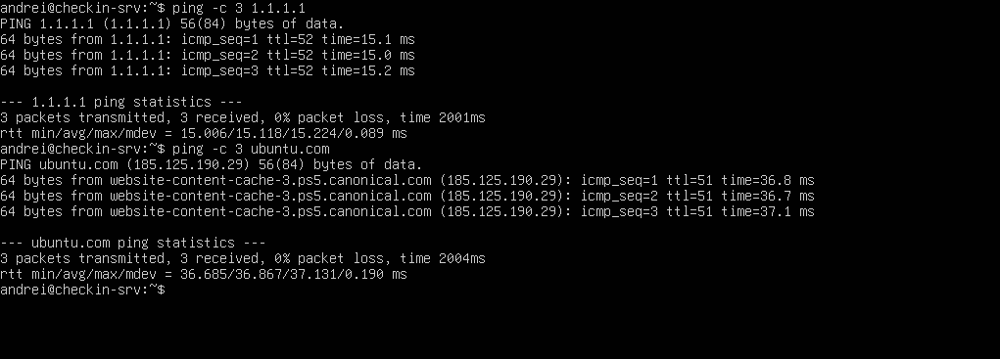

# Chapter 3 – Perimeter Firewall

> Adding the airport's firewall: a single, controlled gateway between the check-in zone and the outside world.

**Status:** Completed – lab version 0.2

---

## Why a firewall

In version 0.1 the check-in zone was completely isolated: safe, but unable to download updates or software. The quick fix would be to connect machines to the internet temporarily whenever needed. The professional solution is a **firewall acting as the only border crossing** of the zone: all traffic in and out goes through it, and it decides what is allowed.

The firewall also performs **NAT**: like a company switchboard, it lets all internal machines reach the internet through a single external address, hiding the internal addressing plan.

## Architecture



| Setting | `fw-monteverde` |
|---|---|
| Software | **OPNsense 26.7** (open source, FreeBSD-based) |
| Generation | 2 (UEFI) – **Secure Boot disabled** (FreeBSD bootloader is not in Hyper-V's trusted list) |
| vCPU / RAM / Disk | 2 / 4 GB / 32 GB (ZFS, single disk) |
| WAN – `hn0` | Hyper-V *Default Switch*, address via DHCP |
| LAN – `hn1` | `Checkin-Zone` private switch, **10.10.2.65/27** – the gateway reserved in the [addressing plan](../01-network-design/README.md) |



## Security choices

- **Verified download:** the image was checked with SHA-256 before installation, taking the checksum from the official OPNsense sources rather than from the download mirror (mirrors are run by third parties)
  ```powershell
  Get-FileHash .\OPNsense-26.7-dvd-amd64.iso.bz2 -Algorithm SHA256
  ```
- **Web interface reachable only from the LAN** – never exposed on the WAN side
- **HTTPS kept for the web interface**, so the root password never travels in clear text; the self-signed certificate was checked against the SHA-256 fingerprint shown on the firewall console
- **No DHCP on the check-in LAN:** all hosts use planned static addresses, so an unknown device plugged into the zone does not automatically get network access
- **IPv6 disabled** for now: fewer active features, less to protect
- **Strong, unique root password**, stored in a password manager

## Base configuration

| Item | Value |
|---|---|
| Hostname | `fw-monteverde` |
| Domain | `monteverde.internal` (`.internal` is reserved for private use) |
| DNS | Built-in **Unbound** resolver, serving the LAN |
| Outbound NAT | Automatic |
| Time zone | Europe/Rome |



Both check-in hosts now use the firewall as their **DNS server** (10.10.2.65):

- **Server:** `nameservers: addresses: [10.10.2.65]` added to the netplan configuration, applied with `sudo netplan try`
- **Workstation:** preferred DNS server set to 10.10.2.65 in the IPv4 settings

## Tests

Connectivity was tested in layers, so that a failure points to the exact component:

```bash
ping -c 3 1.1.1.1      # IP routing and NAT through the firewall
ping -c 3 ubuntu.com   # DNS resolution via Unbound
sudo apt update        # real-world check: package downloads through the firewall
```

All tests passed from `checkin-srv`; `checkin-pc01` can browse the web through the firewall.



## Known limitation (by design, for now)

OPNsense's default LAN rule **allows all outbound traffic**. This is convenient while installing software, but it does not yet follow the *default deny* principle defined in [Chapter 1](../01-network-design/README.md). Tightening the rules is the goal of the next chapter.

## Lessons learned

- **Boot order matters:** Generation 2 VMs try the DVD first, so the installer kept restarting after installation. The fix was moving the hard disk to the top of the firmware boot order and detaching the ISO
- **Interface assignment must be verified:** the live installer assigned LAN/WAN the opposite way to the plan; interfaces were mapped explicitly (WAN = `hn0`, LAN = `hn1`)
- **A checksum is only useful if it belongs to the right file:** the download page displayed the checksum of a different image type, which would have caused a false alarm
- The setup wizard only auto-configures DHCP on networks larger than /27 – irrelevant here, as the zone uses static addressing by design
