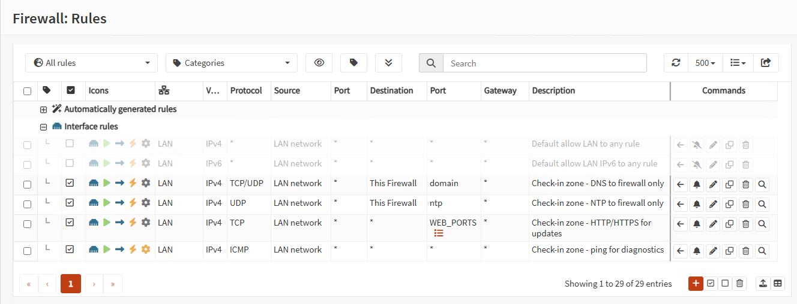
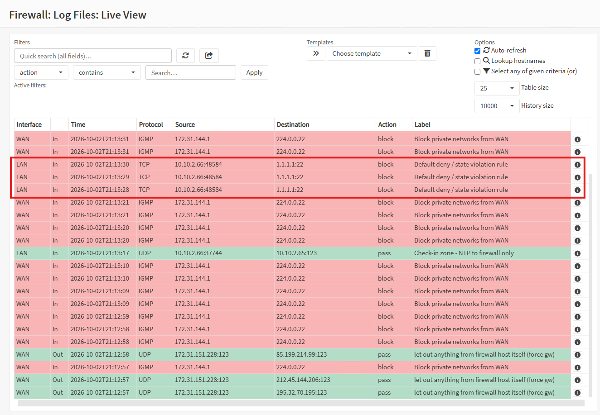
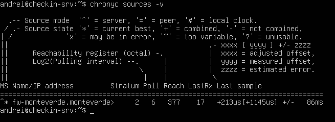
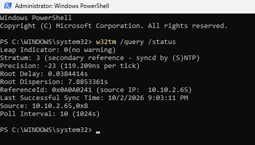

# Chapter 4 – Firewall Rules

> Turning the firewall from "let everything out" into **default deny**: only the traffic the check-in zone actually needs is allowed – and investigating the first real anomaly found in the logs.

**Status:** Completed – lab version 0.3

---

## Principles

- **Default deny:** traffic is blocked unless a rule explicitly allows it – a guest list, not an open door
- **First match wins:** rules are evaluated top to bottom and the first matching rule decides
- **Stateful filtering:** return traffic of an allowed connection is permitted automatically, so rules are only written for traffic **leaving** the check-in zone

## What the check-in zone needs

| Traffic | Destination | Why |
|---|---|---|
| DNS (53) | **Firewall only** | Name resolution |
| NTP (123) | **Firewall only** | Synchronized clocks – essential for correlating logs |
| HTTP/HTTPS (80, 443) | Internet | System updates |
| ICMP echo request | Any | Network diagnostics |

Everything else is blocked.

**Why DNS only via the firewall?** Malware often uses its own external DNS servers, sometimes to exfiltrate data. Forcing all lookups through the firewall's resolver makes every DNS request **visible and controllable** – groundwork for the SOC chapter.

## Implementation

**Alias** – `WEB_PORTS` (Port type): `80`, `443`. Defined once, reused in rules.

**Rules on the LAN interface** (all: Pass · Direction in · IPv4 · Source *LAN network* · Logging enabled):

| # | Protocol | Destination | Port | Description |
|---|---|---|---|---|
| 1 | TCP/UDP | This Firewall | 53 | Check-in zone - DNS to firewall only |
| 2 | UDP | This Firewall | 123 | Check-in zone - NTP to firewall only |
| 3 | TCP | any | `WEB_PORTS` | Check-in zone - HTTP/HTTPS for updates |
| 4 | ICMP (echo request) | any | – | Check-in zone - ping for diagnostics |

- The default **"allow LAN to any"** rules (IPv4 and IPv6) were **disabled, not deleted**, to allow a quick rollback
- The **anti-lockout rule** was kept, so the management interface stays reachable from the LAN



## Tests: positive and negative

Testing that allowed traffic works is not enough – blocked traffic must actually be blocked.

```bash
# Must succeed
ping -c 3 1.1.1.1
ping -c 3 ubuntu.com
sudo apt update

# Must fail (timeout)
nc -vz -w 3 1.1.1.1 22    # SSH to the internet
nc -vz -w 3 8.8.8.8 53    # bypassing the firewall's DNS
```

All tests behaved as expected. In **Firewall → Log Files → Live View**, the blocked attempts appear as `block` entries labelled *Default deny*, while legitimate traffic is matched by the rules above.



## Investigation: an anomaly in the logs

### Observation
Filtering the live log on the LAN interface showed dozens of blocked connections from `checkin-srv` (10.10.2.66) to `91.189.91.112` and `91.189.91.113` on **TCP port 4460**.

### Analysis
- **Destination:** addresses in Canonical's network (the company behind Ubuntu)
- **Port 4460/tcp:** used by **NTS** (Network Time Security) to establish authenticated time synchronization
- **Evidence:** Ubuntu's chrony configuration (`/etc/chrony/sources.d/ubuntu-ntp-pools.sources`) states that NTS is used by default and needs port 4460/tcp

**Conclusion:** not an attack – the server was trying to set its clock directly from the internet, bypassing the design in which the firewall is the single time source.

### Decision
| Option | Assessment |
|---|---|
| A. Allow 4460/tcp to Canonical | Every host manages its own time source – more rules, less control |
| **B. Centralize time on the firewall** | Single time source for the whole airport, consistent with the design |

**Accepted risk:** inside the isolated check-in zone, time is distributed with plain NTP (not authenticated). The firewall itself synchronizes from public NTP servers.

### Implementation
**Server** – Ubuntu's NTS pool entries were commented out and the firewall added as the only source:
```bash
echo "server 10.10.2.65 iburst" | sudo tee -a /etc/chrony/chrony.conf
sudo systemctl restart chrony
```

**Workstation** – Windows Time configured to use the firewall:
```powershell
Set-Service w32time -StartupType Automatic
Start-Service w32time
w32tm /config /manualpeerlist:"10.10.2.65,0x8" /syncfromflags:manual /update
Restart-Service w32time
w32tm /resync
```

### Troubleshooting along the way
| Symptom | Cause | Fix |
|---|---|---|
| `w32tm /config` failed with `0x80070426` | Windows Time service was stopped | Service set to automatic and started |
| Windows source: *VM IC Time Synchronization Provider* | Hyper-V was pushing the host's clock into the VM | **Time synchronization** integration service disabled on all lab VMs |
| `chronyc sources`: `^?`, Reach 0 | The firewall answered, but declared itself unsynchronized (`Leap status: Not synchronised`, Reference ID `INIT`, stratum 0 – seen with `sudo chronyc ntpdata 10.10.2.65`) | The firewall's own NTP service had not yet selected an upstream source. After enabling **iburst** and restarting the service, it selected an active peer within seconds |

### Verification
- `chronyc sources -v` on the server: firewall selected as current source (`^*`)
- `w32tm /query /status` on the workstation: `Source: 10.10.2.65`, leap indicator *no warning*
- Live log: **no new blocked connections on port 4460**; NTP traffic now matches the rule *NTP to firewall only*





## Known limitation

The perimeter firewall only filters traffic that **passes through it**. `checkin-pc01` and `checkin-srv` are on the same subnet and talk to each other directly, so the rule "the workstation may only use the check-in application on the server" cannot be enforced here. It requires a **host-based firewall** on the server – a later step in a *defense in depth* approach.

## Lessons learned

- **Read the logs before assuming:** the noise expected (NetBIOS, discovery protocols) was not what the logs actually showed
- **Blocked traffic is information:** a default-deny policy turned an invisible behavior (direct time sync to the internet) into a visible, fixable one
- **The fault can be upstream of the symptom:** the server looked broken, but the problem was the firewall's own time service
- **Hypervisor features can silently override guest configuration** (Hyper-V time synchronization)
- **Diagnose in layers:** request sent → response received → response valid → response usable (`Total RX` vs `Total good RX`)
