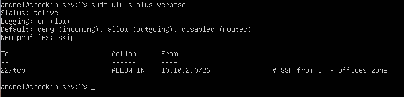
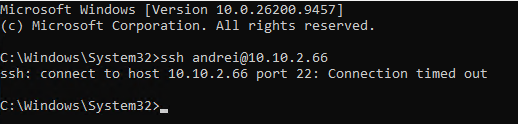
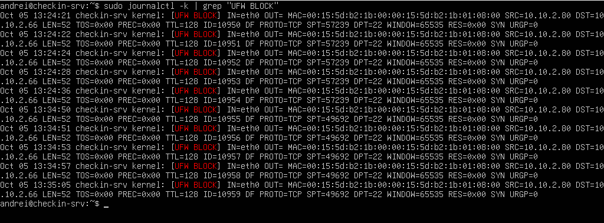

# Chapter 5 – Host Firewall

> A second layer of defense on the check-in server itself, closing the gap left by the perimeter firewall.

**Status:** Completed – lab version 0.4

---

## Why a second firewall: defense in depth

Think of a medieval castle: the **city walls** (the perimeter firewall) stop attackers coming from outside, but someone already **inside the walls** can walk straight up to the palace door. That is why the palace has **its own lock**.

`checkin-pc01` and `checkin-srv` sit on the same subnet and communicate directly, without passing through OPNsense (see the [known limitation in Chapter 4](../04-firewall-rules/README.md)). If an attacker compromised the operator's workstation – for example through phishing – the perimeter firewall would never see the traffic towards the server. A **host-based firewall** on the server does.

## What the server should accept

| Inbound traffic | From | Decision |
|---|---|---|
| SSH (22/tcp) | IT staff – **Offices zone (10.10.2.0/26)** | Allowed |
| SSH (22/tcp) | Check-in desks (operator workstations) | Blocked – operators have no reason to administer the server |
| Check-in application | Check-in desks | ⏳ Rule added when the application is deployed – a port is only opened when a service sits behind it |
| ICMP echo (ping) | Any | Allowed by ufw defaults, for diagnostics |
| Everything else | Any | Blocked |

The Offices zone does not exist in the lab yet, so for now the server is administered from the **Hyper-V console** – consistent with the design.

## Implementation (ufw)

```bash
sudo ufw default deny incoming
sudo ufw default allow outgoing
sudo ufw allow from 10.10.2.0/26 to any port 22 proto tcp comment 'SSH from IT - offices zone'
sudo ufw logging low
sudo ufw enable
```

- **deny incoming:** default deny, this time on the host
- **allow outgoing:** outbound traffic is already controlled by the perimeter firewall – no need to duplicate it here
- **comment:** documents *why* the rule exists, directly in the ruleset

> **Operational rule:** on a remote server, always add the rule that allows your own access **before** enabling the firewall – otherwise you lock yourself out. Here the change was made from the Hyper-V console, so there was no risk.

Verification:

```bash
sudo ufw status verbose
```

`Status: active` · `Default: deny (incoming), allow (outgoing)` · one rule: 22/tcp from 10.10.2.0/26.



## Tests: before and after

| Test (from `checkin-pc01`) | Before ufw | After ufw |
|---|---|---|
| `ssh <user>@10.10.2.66` | Password prompt – the operator workstation **could** reach SSH | **Timeout** – blocked |
| `ping 10.10.2.66` | Replies | Replies |

From the server, `sudo apt update` still works: outbound traffic is unaffected.



The blocked attempt is visible in the kernel log:

```bash
sudo journalctl -k | grep "UFW BLOCK"
```

Entries show `SRC=10.10.2.80` (the operator workstation) and `DPT=22` (SSH) – the same *action → log evidence* cycle used on the perimeter firewall, now on the host.



## Lessons learned

- A perimeter firewall cannot filter traffic between hosts on the same subnet: **segmentation and host firewalls complement each other**
- Testing **before and after** a change is the clearest proof that a control works
- Rules should exist only for services that are actually running, and carry a comment explaining their purpose
