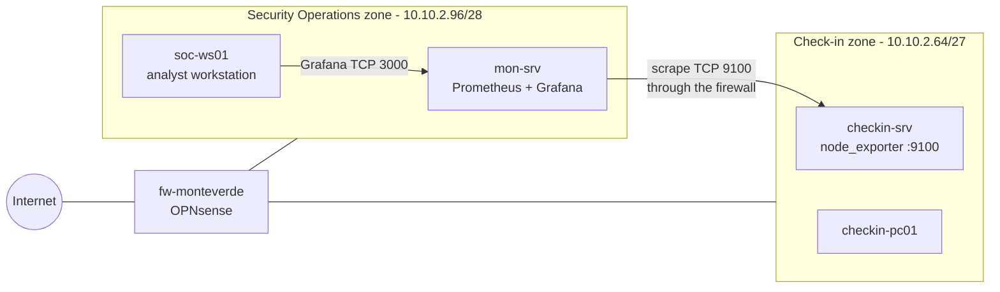
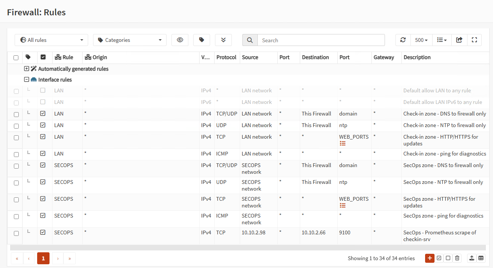
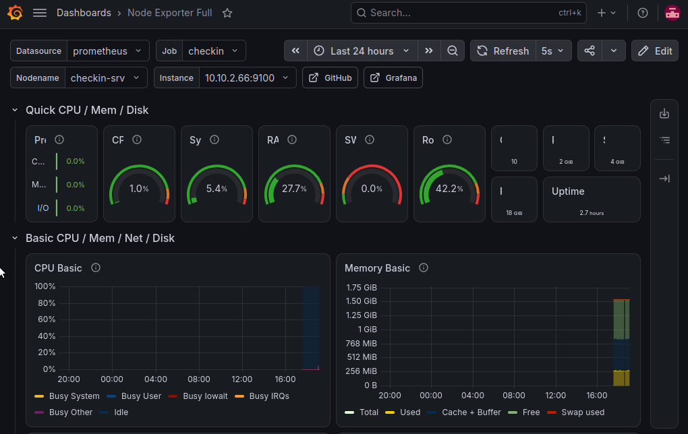
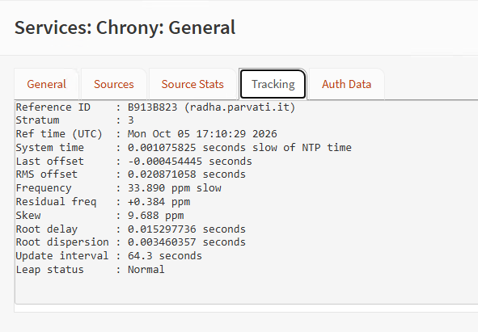

# Chapter 6 – Monitoring

> A dedicated Security Operations zone – the airport's control room – with Prometheus and Grafana watching the check-in server.

**Status:** Completed – lab version 0.6

---

## Why monitoring, and why a separate zone

Monitoring is the airport's **dashboard**: it shows whether the check-in server is up, running out of disk or overloaded – *before* passengers start queuing. After the Collins Aerospace incident, detecting quickly that a system has stopped responding makes a real difference.

**Design decision:** security and monitoring tools do not live on the systems they watch. If an attacker compromised the check-in server, monitoring running on the same machine could be switched off or falsified – like placing the CCTV room inside the shop it is meant to watch. The monitoring stack therefore lives in a **new, dedicated network zone**.

## The Security Operations zone

Sized for up to 12 devices (monitoring, SIEM, analyst workstation):

- /29 → 2³ − 2 = 6 hosts
- **/28 → 2⁴ − 2 = 14 hosts** – starts at 10.10.2.96, the first free address in the [addressing plan](../01-network-design/README.md)

| Network | Mask | First usable | Last usable | Broadcast |
|---|---|---|---|---|
| 10.10.2.96/28 | 255.255.255.240 | 10.10.2.97 | 10.10.2.110 | 10.10.2.111 |

| Address | Host | Role |
|---|---|---|
| 10.10.2.97 | `fw-monteverde` (SECOPS interface) | Gateway, DNS, time source |
| 10.10.2.98 | `mon-srv` | Prometheus + Grafana (Ubuntu Server) |
| 10.10.2.99 | – | Reserved for the SIEM (Wazuh) |
| 10.10.2.100 | `soc-ws01` | Analyst workstation (Xubuntu) |



## Network and firewall changes

- New Hyper-V private switch **`SecOps-Zone`**
- Third firewall interface **`hn2`**, assigned as **`SECOPS`** – 10.10.2.97/28
- A new OPNsense interface has **no rules**, so everything is blocked by default
- SECOPS rules mirror the check-in zone: **DNS and NTP to the firewall only, HTTP/HTTPS for updates, ping**
- One **inter-zone rule**, the only path from the control room into the check-in zone:

| Interface | Source | Destination | Port | Description |
|---|---|---|---|---|
| SECOPS | 10.10.2.98 (`mon-srv`) | 10.10.2.66 (`checkin-srv`) | TCP 9100 | SecOps - Prometheus scrape of checkin-srv |

Prometheus works on a **pull model**: `mon-srv` reads metrics from the check-in server, never the other way round. Only that single direction is opened – and only from a single host, not the whole zone.



## Host firewalls (ufw)

| Host | Inbound allowed | Notes |
|---|---|---|
| `checkin-srv` | 22/tcp from 10.10.2.0/26 · **9100/tcp from 10.10.2.98 only** | Scrape rule added when node_exporter was installed |
| `mon-srv` | 22/tcp from 10.10.2.0/26 · **3000/tcp from 10.10.2.100 only** | Grafana reachable only from the analyst workstation |
| `soc-ws01` | **Nothing** | A workstation initiates connections, it never accepts them |

`soc-ws01` and `mon-srv` share the same subnet, so their traffic never crosses OPNsense: access to Grafana is enforced by **ufw on `mon-srv`** – the same lesson as [Chapter 5](../05-host-firewall/README.md), seen from the other side.

## Monitoring stack

**On `checkin-srv`** – metrics exporter from the Ubuntu repositories:
```bash
sudo apt install -y prometheus-node-exporter
```

**On `mon-srv`** – Prometheus, with a scrape job for the check-in server in `/etc/prometheus/prometheus.yml`:
```yaml
  - job_name: 'checkin'
    static_configs:
      - targets: ['10.10.2.66:9100']
        labels:
          zone: 'check-in'
          role: 'checkin-server'
```
The configuration is validated **before** restarting the service:
```bash
promtool check config /etc/prometheus/prometheus.yml
```

**Grafana** – installed from the official Grafana Labs APT repository. Packages are accepted only if signed with Grafana's published key (`signed-by=/etc/apt/keyrings/grafana.asc`), so a tampered package would be rejected.

- Default `admin/admin` credentials replaced at first login
- Prometheus added as data source (`http://localhost:9090`)
- Community dashboard **Node Exporter Full** (ID 1860) imported

**Distribution packages vs. upstream binaries:** Prometheus and node_exporter come from Ubuntu's repositories – not the newest versions, but updated with the system and run as managed services, which favors stability and maintainability.

## Tests

- Prometheus target health: `curl -s 'localhost:9090/api/v1/query?query=up'` returns `1` for `10.10.2.66:9100`
- Firewall Live View: scrape traffic from 10.10.2.98 to 10.10.2.66:9100 matched by the inter-zone rule
- **End-to-end test:** a CPU load was generated on the check-in server, and the spike appeared on the Grafana dashboard within seconds
  ```bash
  timeout 60 yes > /dev/null
  ```



## ⏱️ Infrastructure change: chrony replaces ntpd on the firewall

### Problem
After the firewall was rebooted (RAM change, new network interface), every client again showed its time source as unusable (`^?`). `sudo chronyc ntpdata` showed replies arriving (`Total RX` > 0) but none usable (`Total good RX 0`, `Leap status: Not synchronised`). The firewall's built-in **ntpd** needed a long time after each boot before declaring itself synchronized, and its offsets and jitter on the virtual machine were high – a **recurring** problem, not a one-off.

### Decision
Replace ntpd with **chrony** via the official **os-chrony** plugin. chrony is designed to synchronize quickly and cope with unstable clocks such as those of virtual machines – and it is the same time daemon already used by every Ubuntu host in the lab.

### Change management
1. Plugin installation required the firewall to be up to date: **firmware updated to OPNsense 26.7.5**, with a **Hyper-V checkpoint taken before the update** as a rollback plan
2. chrony configured with four `opnsense.pool.ntp.org` sources, **listen port 123** and an explicit allow list: `10.10.2.64/27` and `10.10.2.96/28` – chrony only serves time to listed networks, which also prevents abuse for NTP amplification attacks
3. ntpd stopped to free port 123, then chrony enabled

### Result
| | ntpd | chrony |
|---|---|---|
| Time to synchronize after boot | Many minutes, often never declared synchronized | **Seconds** |
| Clock offset | Hundreds of milliseconds | **Microseconds** |
| Leap status | Not synchronised | **Normal** |

Verified after a full firewall reboot: chrony resynchronized on its own, and all clients selected the firewall as their time source (`^*`).



## Accepted risks

- **Grafana is served over HTTP** inside the Security Operations zone: the login travels unencrypted, but the zone is isolated and Grafana is reachable only from the analyst workstation. Adding a TLS certificate is a planned improvement
- **Internal time distribution is unauthenticated NTP** (see [Chapter 4](../04-firewall-rules/README.md)). NTS is available in the chrony plugin for the firewall's upstream sources and can be evaluated later

## Lessons learned

- **Security tooling belongs in its own zone**, separate from the systems it watches
- **Open only what the architecture needs:** a single host, a single port, a single direction
- **Validate configuration before applying it** (`promtool check config`) instead of discovering errors through a failed service
- **A problem that comes back after every reboot is a design problem**, and deserves a structural fix rather than waiting it out
- **Patch before you extend:** the firewall had to be updated before installing new components – with a rollback point first
