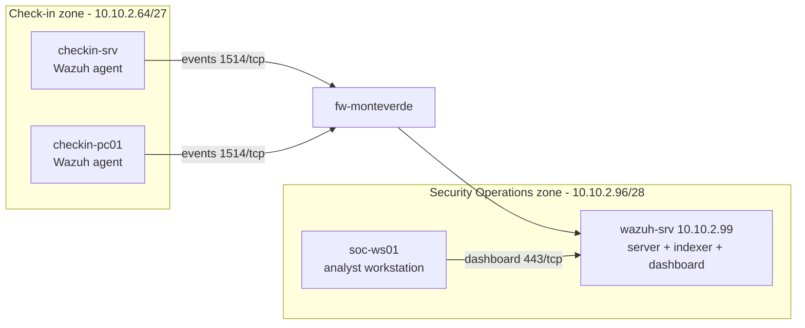
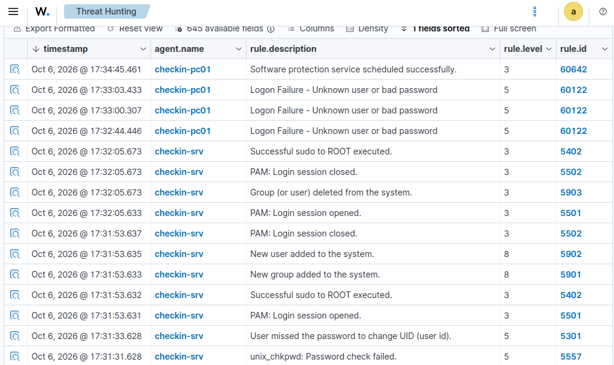

# Chapter 7 – Security Operations Center (Wazuh)

> The lab moves from *watching whether systems are healthy* to **detecting attacks**: a Wazuh SIEM collecting and analysing security events from every machine, on Linux and Windows alike.

**Status:** Completed – lab version 0.7

---

## Monitoring vs. detection

- **Prometheus** (Chapter 6) is the **doctor**: it measures the *health* of systems – CPU, memory, disk. It says *"the server is unwell."*
- **Wazuh** is the **security guard watching the cameras**: it observes *behaviour* and recognises the suspicious kind – failed logins, new users, modified system files, insecure settings. It says *"someone is trying to break in."*

Wazuh is a **SIEM**: it centralises logs from every machine, analyses them against thousands of built-in rules, and raises **alerts** graded by severity.

## Architecture: a pull tool and a push tool

| | Prometheus (monitoring) | Wazuh (detection) |
|---|---|---|
| Data flow | **Pull** – `mon-srv` reads from targets | **Push** – agents send events to the server |
| Firewall direction | SecOps → check-in | **check-in → SecOps** |

Because agents *send* data, the inter-zone firewall rule runs in the **opposite direction** to the monitoring one – a consequence of the protocol, not an arbitrary choice.



## The Wazuh server

| | `wazuh-srv` |
|---|---|
| Zone | Security Operations – 10.10.2.99/28 |
| OS | **Ubuntu Server 24.04 LTS** |
| Resources | 4 vCPU · 8 GB RAM · 80 GB disk |
| Components | Wazuh server + indexer + dashboard (all-in-one) |

**OS choice:** the lab's other servers run a newer Ubuntu, but Wazuh's documentation lists 24.04 as the most recent **supported** release. A production security tool is installed only on a vendor-supported platform – running two Ubuntu versions side by side is normal and deliberate.

**Time synchronization:** Ubuntu 24.04 uses `systemd-timesyncd`, not chrony. It was pointed at the firewall with a drop-in file, keeping custom settings separate from the vendor's:
```
/etc/systemd/timesyncd.conf.d/monteverde.conf
[Time]
NTP=10.10.2.97
FallbackNTP=
```
Servers run on **UTC**, so logs from every machine share one timeline regardless of local time or DST.

## Secure installation

- A **checkpoint** was taken before installing (`pre-wazuh`)
- The official installation assistant was **reviewed** (`less wazuh-install.sh`) before being run as root – never execute a downloaded script blindly
- Installed all-in-one: `sudo bash ./wazuh-install.sh -a`
- The randomly generated admin password was stored in a password manager; `wazuh-install-files.tar` (all internal passwords) was restricted and moved to `/root`:
  ```bash
  sudo chmod 600 wazuh-install-files.tar && sudo mv wazuh-install-files.tar /root/
  ```
- **Automatic updates disabled**, as the vendor recommends: the three components must stay on the same version, so upgrades are planned, not accidental
  ```bash
  sudo sed -i "s/^deb /#deb /" /etc/apt/sources.list.d/wazuh.list
  ```

## Host firewall (ufw) on `wazuh-srv`

| Port | Service | Allowed from |
|---|---|---|
| 1514–1515/tcp | Agent events and enrollment | Check-in zone and SecOps zone |
| 443/tcp | Dashboard | **`soc-ws01` only** |
| 22/tcp | SSH | Offices (IT) zone only |

Internal ports (indexer, API) stay closed: those components talk to each other on the same host.

## 🚦 Inter-zone firewall rule

Alias `WAZUH_AGENT_PORTS` = 1514, 1515.

| Interface | Source | Destination | Port | Description |
|---|---|---|---|---|
| LAN | LAN network (whole check-in zone) | 10.10.2.99 | WAZUH_AGENT_PORTS | Check-in zone - Wazuh agents to wazuh-srv |

Source is the whole zone (every machine gets an agent); destination is still **one host, two ports**.

## 🛰️ Agents

Deployed from the dashboard's **Deploy new agent** wizard, which generates the exact command per OS:

| Agent | OS | Package |
|---|---|---|
| `checkin-srv` | Ubuntu Server | DEB amd64 |
| `checkin-pc01` | Windows 11 | MSI |

Both report **Active** in the dashboard.

## Detection test

Simulated attacker actions on both endpoints, then read the alerts in **Threat Hunting**:

| Action | Host | Wazuh alert (rule.id) | Level |
|---|---|---|---|
| `su -` with wrong password ×3 | checkin-srv | unix_chkpwd: Password check failed (5557) | 5 |
| `useradd backdoor-test` | checkin-srv | **New user added to the system (5902)** | **8** |
| `userdel` cleanup | checkin-srv | Group (or user) deleted from the system (5903) | 3 |
| `runas /user:hacker-test` ×3 | checkin-pc01 | Logon Failure - Unknown user or bad password (60122) | 5 |

Reading an alert, like an analyst: **description** (what happened), **level** (severity 0–15, higher = more urgent), and **MITRE ATT&CK** technique when mapped – e.g. account creation is **T1136 – Create Account** (persistence). Creating a user scored level 8, higher than a successful sudo, because it is a classic persistence move.



**Why time sync mattered:** events from `checkin-srv` (Linux) and `checkin-pc01` (Windows), in completely different log formats, lined up on **one timeline**. Without synchronized clocks, correlating them would be unreliable – which is why so much care went into the time source.

## Known limitations / planned hardening

- **Agent enrollment is unauthenticated:** anyone able to reach port 1515 can register an agent. Limited today by firewall and ufw rules; Wazuh supports an **enrollment password**, to be added later
- **File Integrity Monitoring is not real-time by default:** the alert for a file dropped in `C:\Windows\...` appears on the next scheduled scan, not immediately. Critical paths can be set to `realtime`
- **The firewall management interface is reachable from inside the zones:** the "HTTP/HTTPS to any" rules also allow reaching the firewall itself, and the check-in firewall has been administered from the operator workstation. Management should be restricted to an admin host, and "to any" rules should exclude the firewall

## Lessons learned

- **Detection complements monitoring:** health metrics and security events answer different questions
- **Data-flow direction drives firewall design:** a pull tool and a push tool need opposite rules
- **Use vendor-supported platforms** for critical tools, even if it means running mixed OS versions
- **Synchronized time is what makes cross-system correlation possible** – the payoff of Chapter 6's work
- **Protect the keys to the SIEM:** generated passwords and the install bundle are high-value secrets
