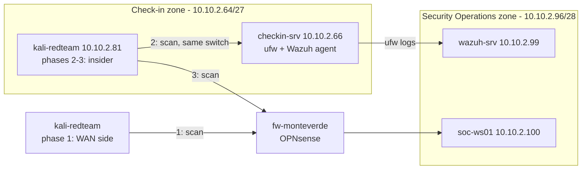
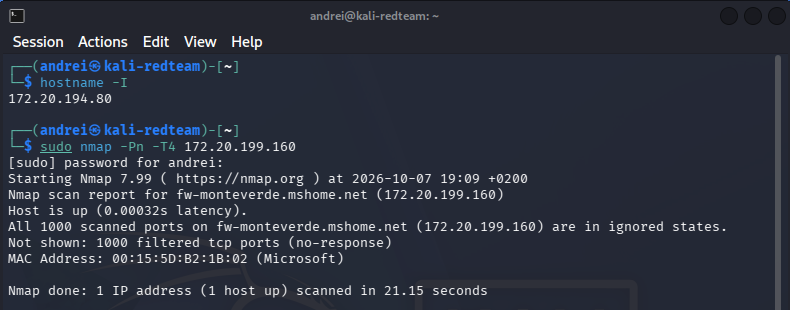
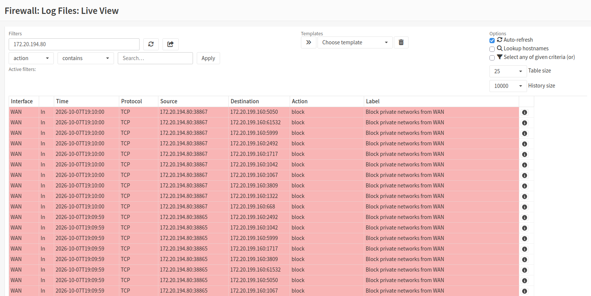
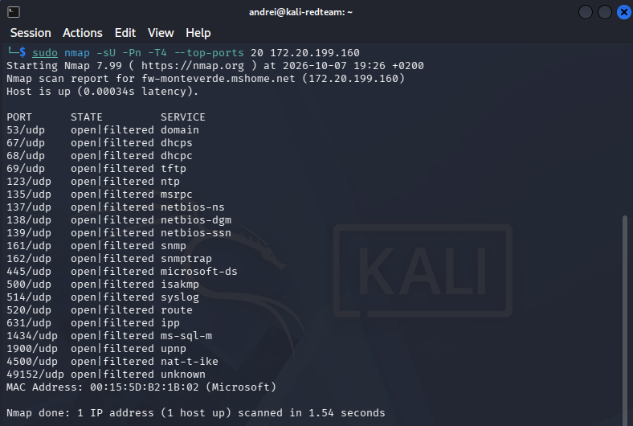
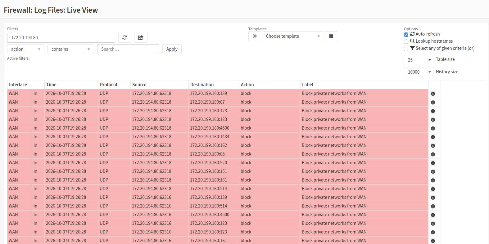
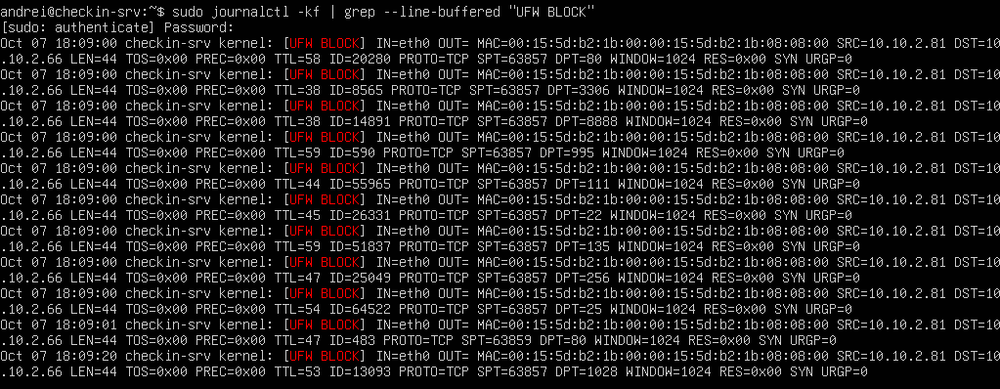
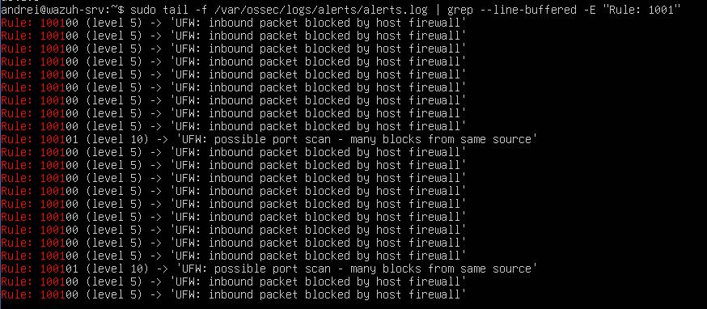
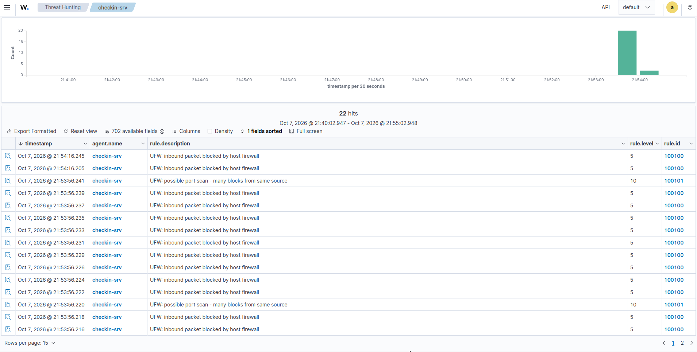

# Chapter 8 – Attack simulation (reconnaissance)

> The lab switches sides: a **Kali Linux** attacker probes Monteverde Airport from the outside, from inside the check-in zone and across zones. The goal is not to "win", but to check that every attempt is **blocked and logged** – and to fix what isn't.

**Status:** Completed – lab version 0.8

---

## Why attack your own lab

Building defenses and never testing them is like installing locks and never trying the doors. A simulated attack asks two questions about every control:

1. **Prevention:** was the attempt blocked?
2. **Detection:** did it leave a trace the SOC can actually see?

A control that blocks without reporting stops the attacker but leaves the defenders blind. This chapter focuses on **reconnaissance** – the first step of almost every attack: finding out which hosts and ports answer.

All activity took place inside the isolated lab, against my own virtual machines only.

## The attacker: `kali-redteam`

| | `kali-redteam` |
|---|---|
| OS | Kali Linux (official installer ISO, **SHA-256 verified**) |
| VM | Generation 2 · 2 vCPU · 4 GB RAM (fixed) · 40 GB disk |
| User | Standard user account |
| Checkpoints | `kali-clean-install`, `kali-updated` |

**Secure Boot disabled:** with Hyper-V's *Microsoft UEFI Certificate Authority* template, the Kali image was rejected at boot. Secure Boot was turned off on this VM only – an accepted trade-off for a test machine that holds no data. The defended Linux servers keep Secure Boot enabled.

**Resource planning:** on a 32 GB host, Windows and Hyper-V use about 8–10 GB, leaving roughly 20 GB for VMs. The attack profile was `fw-monteverde` + `wazuh-srv` + `soc-ws01` + `checkin-srv` + `kali-redteam`, with `checkin-pc01` powered off.

## Three attacker positions

| Phase | Position | Network setup | What it simulates |
|---|---|---|---|
| 1 – External | WAN side of the firewall | `Default Switch`, DHCP | An attacker on the internet |
| 2 – Insider | Check-in zone | `Checkin-Zone`, static **10.10.2.81/27** (gateway/DNS .65, set with `nmcli`) | A compromised device already inside the check-in zone |
| 3 – Cross-zone | Check-in zone → Security Operations | Same as phase 2 | The insider trying to reach the SOC zone |

Phases 2 and 3 follow an **assume breach** approach: they start from the point where the attacker already has a foothold in the check-in zone. The phishing step that would create that foothold was **not** simulated in this chapter.



## Phase 1 – External reconnaissance

From the WAN side, Kali scanned the firewall with **Nmap**: the default 1000 TCP ports and the top 20 UDP ports.

| Scan | Nmap result | Firewall log |
|---|---|---|
| TCP, 1000 ports | All **filtered** | Blocked on WAN – *Block private networks from WAN* |
| UDP, top 20 | All **open\|filtered** | Blocked on WAN – *Block private networks from WAN* |

**Reading the results:** *filtered* means no answer at all – like knocking on a door where nobody even says "go away". For UDP, silence is ambiguous: a service may be listening without replying, or the packet may have been dropped – hence *open\|filtered*. The firewall log removes the doubt: every probe was dropped and recorded.









**Lab limitation:** behind Hyper-V's Default Switch, Kali has a **private** IP address. The rule that fired is therefore *Block private networks from WAN*, not the default deny that would stop a real attacker with a public address. The test proves that the WAN blocks and logs, but it does not reproduce the internet path exactly.

## Phase 2 – Insider in the check-in zone

With Kali placed at 10.10.2.81, it scanned `checkin-srv` (10.10.2.66).

Traffic inside the same zone travels on the same switch and **never passes through the firewall** – OPNsense sees nothing. The perimeter firewall is the door between departments; inside the department, the only lock is the one on the server itself: **ufw** (Chapter 5). It did its job: the probes were blocked and recorded as `UFW BLOCK` in `/var/log/ufw.log`.



### A blind spot: the blocks never reached the SIEM

ufw blocked the scan, but **Wazuh showed nothing**. Prevention worked; detection did not. An analyst watching the dashboard would never have known an insider was mapping the check-in server.

There were two causes, found and fixed one at a time.

**1. The agent was not reading the ufw log.** A `<localfile>` block was added to the Wazuh agent configuration on `checkin-srv`:

```xml
<localfile>
  <log_format>syslog</log_format>
  <location>/var/log/ufw.log</location>
</localfile>
```

**2. The events were claimed by the wrong decoder.** Real ufw lines use an ISO 8601 timestamp and the program name `kernel`, so Wazuh's built-in `kernel` decoder picked them up first and a standalone custom decoder never fired. A test line typed by hand had matched and given a **false positive** – only testing with a real line from `ufw.log` (`wazuh-logtest`) showed the problem. The fix was a **child decoder** of `kernel` that extracts source/destination IP, protocol and ports: [`wazuh/local_decoder.xml`](wazuh/local_decoder.xml).

**Detection rules** – [`wazuh/local_rules.xml`](wazuh/local_rules.xml):

| Rule ID | Level | Logic | Meaning |
|---|---|---|---|
| 100100 | 5 | Decoded as `kernel` and matches `UFW BLOCK` | One packet blocked by the host firewall – normal background noise |
| 100101 | **10** | 10 × rule 100100 from the **same source IP** within 60 seconds | **Possible port scan** |

One blocked packet is not an incident; many from the same source in a short time is a pattern. Rule 100101 turns individual events into a **correlated alert**. Both rules were verified live by repeating the scan.





## Phase 3 – Cross-zone: check-in → Security Operations

From the check-in zone, Kali scanned the analyst workstation `soc-ws01` (10.10.2.100).

**Result before the fix:** 998 ports were blocked by the firewall's *Default deny*, but **80 and 443 got through** to the host. The cause was the web rule *"HTTP/HTTPS to any"*: it was meant to let machines download updates from the internet, but **"any" also includes the other internal zones**. It is like a pass for "any building" given to go outside, which also opens the door of the security office.

**The fix** (checkpoint `pre-web-rule-fix` taken first):

- New alias `PRIVATE_NETS` = 10.0.0.0/8, 172.16.0.0/12, 192.168.0.0/16
- Web rules on **LAN** and **SECOPS**: destination set to `PRIVATE_NETS` with **invert** enabled ("anything that is *not* a private network" – in practice, the internet). Rules renamed to *"... HTTP/HTTPS to internet only (updates)"*
- Inverting the destination also removed SecOps' access to the firewall's web interface, so it was granted back explicitly – to one host only:

| Interface | Source | Destination | Port | Description |
|---|---|---|---|---|
| SECOPS | 10.10.2.100 | This Firewall | 443 | SecOps - soc-ws01 admin access to firewall GUI |

**Verification:**

- **Negative test:** the same scan now shows 80/443 as filtered, and the firewall log shows them blocked
- **Positive test:** internet access from `checkin-srv` still works (`curl` returns `HTTP/2 301`)

**Side effect:** this also partly closes a risk declared in Chapter 7. The web rules no longer include the firewall's own addresses, and from the SecOps zone only `soc-ws01` can reach the management interface. On the check-in side, OPNsense's anti-lockout rule still allows it (see limitations).

## Results at a glance

| Phase | Blocked? | Logged? | Seen by the SOC? | Action taken |
|---|---|---|---|---|
| 1 – External | ✅ Firewall (WAN) | ✅ Firewall log | Firewall log only | – |
| 2 – Insider | ✅ ufw | ✅ `ufw.log` | ❌ → ✅ after fix | ufw log collection, decoder, rules 100100/100101 |
| 3 – Cross-zone | ⚠️ All ports except 80/443 → ✅ after fix | ✅ Firewall log | Firewall log only | `PRIVATE_NETS` alias, web rules restricted to the internet |

## MITRE ATT&CK mapping

| Activity | Tactic | Technique |
|---|---|---|
| Port scan of the firewall from the WAN side | Reconnaissance (TA0043) | T1595 – Active Scanning |
| Port scans from inside the check-in zone and across zones | Discovery (TA0007) | T1046 – Network Service Discovery |

The custom rules 100100 and 100101 do not carry a MITRE tag yet, so the mapping is not shown in the Wazuh alerts.

## Operational incident: `wazuh-manager` would not start

During the work, `wazuh-manager` timed out at startup: it had started **before the indexer was ready**, and a stale lock file (`/var/ossec/var/start-script-lock`) blocked every following attempt. Recovery, one step at a time:

```bash
sudo systemctl stop wazuh-manager        # stop the service cleanly
ps aux | grep -i ossec                   # check that no Wazuh process is still running
sudo rm -r /var/ossec/var/start-script-lock   # remove the stale lock only after that check
sudo systemctl start wazuh-manager
```

Removing the lock while processes are still running could leave two instances fighting over the same files – hence the check first.

## Known limitations / open points

- **External test from a private address:** see Phase 1 – the internet path is approximated, not reproduced
- **Firewall GUI still reachable from the check-in zone:** OPNsense's anti-lockout rule on LAN lets any check-in host, including Kali, reach the login page. It will be closed when the Offices/IT zone exists and management can move there
- **ufw logs a sample, not every packet:** with `logging low`, ufw rate-limits its own entries, so Wazuh sees part of the blocked traffic. Thresholds in rule 100101 must take this into account
- **Rule 100101 fires repeatedly during long scans:** it works, but needs tuning to avoid alert fatigue
- **Intra-zone traffic is invisible to the perimeter firewall:** detection inside a zone depends entirely on host logs and agents
- **`soc-ws01` answered *closed* (RST) on 80/443** before the fix, instead of silently dropping as expected from a "deny incoming" ufw policy. Not yet explained – to be checked against its ufw configuration
- **Scope:** this chapter covers reconnaissance only. Phishing, exploitation and lateral movement were not simulated

## Lessons learned

- **Blocked is not the same as detected:** ufw stopped the insider, but until its logs reached Wazuh the SOC was blind
- **Test with real data:** a hand-written log line gave a false positive; only a real `ufw.log` line revealed the decoder problem
- **"Any" means any:** a rule written for internet updates was quietly opening paths between internal zones. Destinations should say exactly what they mean
- **Correlation turns noise into signal:** one blocked packet is level 5, a burst from the same source is a level 10 port-scan alert
- **Every fix can have side effects:** restricting the web rules removed the SOC's access to the firewall GUI, which had to be granted back explicitly and narrowly
- **Know the startup order of your stack:** the Wazuh manager depends on the indexer, and a stale lock can block recovery

## Files

| File | Deployed to (`wazuh-srv`) |
|---|---|
| [`wazuh/local_decoder.xml`](wazuh/local_decoder.xml) | `/var/ossec/etc/decoders/local_decoder.xml` |
| [`wazuh/local_rules.xml`](wazuh/local_rules.xml) | Group appended to `/var/ossec/etc/rules/local_rules.xml` |
