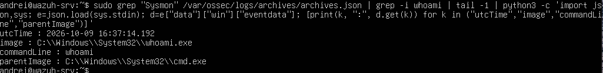
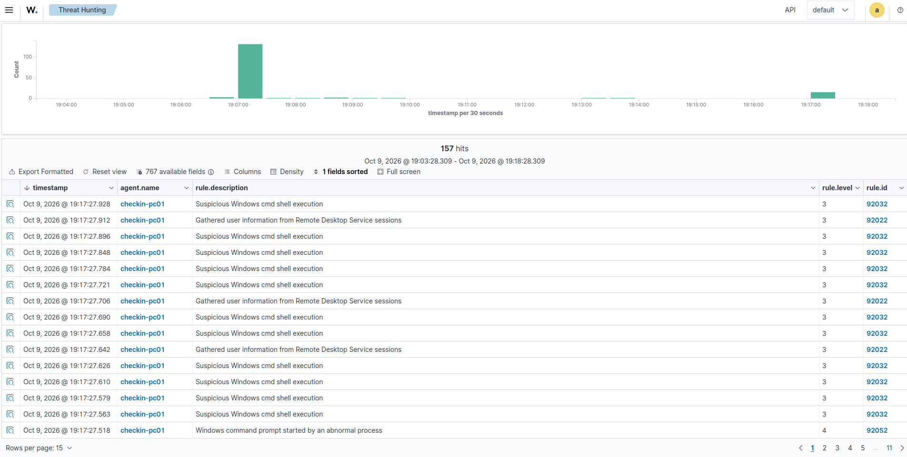
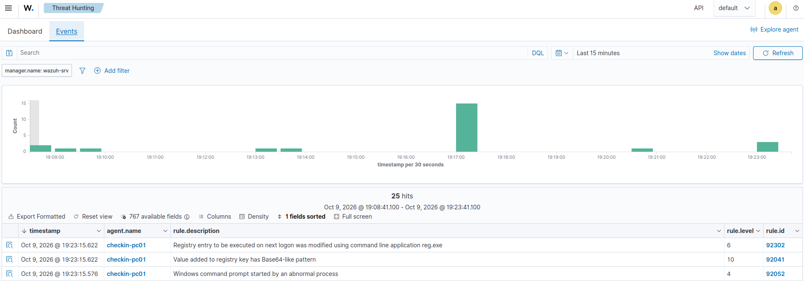
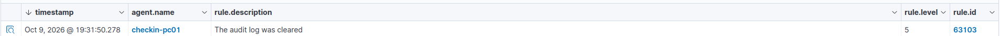
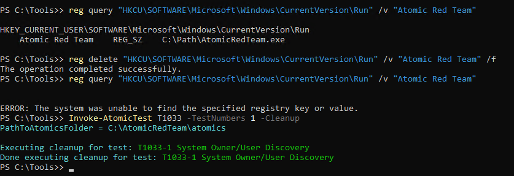

# Chapter 9 – Incident response (assume breach)

> The lab closes the loop: an attacker already inside the check-in zone runs a short attack chain on the operator workstation, the SOC detects it, and the incident is **contained, eradicated and recovered** – then written up as a formal incident report.

**Status:** Completed – lab version 0.9

---

## From detection to response

Chapters 7 and 8 proved the SOC could *see* an attack. Seeing it is only half the job. This chapter answers the next question: **what does the team actually do once an alert fires?**

The work follows the incident response lifecycle from **NIST SP 800-61**: preparation → detection & analysis → containment → eradication → recovery, ending with a report. Building a detection and never rehearsing the response is like installing a fire alarm and never running a fire drill – the alarm works, but nobody knows where the exits are.

All activity took place inside the isolated lab, against my own virtual machines only.

## Scenario and scope

This chapter uses an **assume breach** scenario: it starts from the point where an attacker already controls the check-in operator workstation `checkin-pc01`. The step that would create that foothold – a phishing email opened by the operator – is **not** simulated, and neither is exploitation or lateral movement.

Attacker actions are generated with **[Atomic Red Team](https://github.com/redcanaryco/atomic-red-team)** (Red Canary) and native Windows tools. Atomic Red Team is the industry-standard way to rehearse detections: each test runs a small, documented action tied to a MITRE ATT&CK technique, with a built-in cleanup step. It is a smoke machine for a fire drill, not a real fire – no actual malware is used.

## Preparation: giving the SOC eyes on the endpoint

Standard Windows logs record *who logged in and when*, but not *which programs ran, with what command line, and which process started them*. That last part is exactly what matters during an attack. **Sysmon** (Microsoft Sysinternals) fills the gap: it is a surveillance camera inside the host, recording process creation, network connections and registry changes.

**Install and trust the tool.** Sysmon was installed on `checkin-pc01` and verified by **digital signature** (`Get-AuthenticodeSignature` → *Valid*, signed by Microsoft Corporation), since Microsoft does not publish a SHA-256 hash for it. The configuration is the **balanced [sysmon-modular](https://github.com/olafhartong/sysmon-modular) profile** by Olaf Hartong, a widely used, ATT&CK-aligned ruleset.

**Send the events to the SIEM.** Sysmon writes to its own log channel, which the Wazuh agent does not read by default – the same blind spot pattern seen with ufw in Chapter 8. Instead of editing the agent on the host, the fix was applied through **centralized group configuration** on the manager: a `windows` agent group whose `agent.conf` collects the Sysmon channel. This is how it scales to many endpoints – one change on the manager, pushed to every agent in the group.

```xml
<agent_config os="Windows">
  <localfile>
    <location>Microsoft-Windows-Sysmon/Operational</location>
    <log_format>eventchannel</log_format>
  </localfile>
</agent_config>
```

**Prove the pipeline.** With Wazuh's full event archive temporarily enabled, a harmless `whoami` run on the host appeared end to end in the manager, with its command line, parent process and user – confirming the camera reaches the SOC.



## The attack chain

From the compromised workstation, three techniques were run one at a time, each checked against the Wazuh dashboard.

| # | Tactic / Technique | Attacker action | Key Wazuh alerts |
|---|---|---|---|
| 1 | Discovery – **T1033** System Owner/User Discovery | `whoami`, `wmic useraccount`, `quser`, `qwinsta` | 92032 (lvl 3), 92022 (lvl 3), 92052 (lvl 4) |
| 2 | Persistence – **T1547.001** Registry Run Keys | `reg.exe` adds a value under `...\CurrentVersion\Run` | 92302 (lvl 6), **92041 (lvl 10)** |
| 3 | Defense Evasion – **T1070.001** Clear Windows Event Logs | `wevtutil cl Security` clears the Security log | 63103 (lvl 5) |

**Phase 1 – Reconnaissance.** The actor enumerates users and sessions. Reconnaissance uses legitimate Windows tools, so it is "quiet" activity – yet the ruleset still flagged it, including the command prompt being launched by an abnormal parent process.



**Phase 2 – Persistence.** The actor plants a backdoor that would relaunch at the next logon. This produced the loudest alert of the chain: rule **92041 at level 10**, because the value written to the *Run* key looked like obfuscated (Base64-like) content – a classic hiding trick.



**Phase 3 – Covering tracks.** The actor clears the Windows Security log. It is a noisy, telling action – and a futile one here: the events had **already been forwarded to Wazuh**. The attacker can delete the local logs, but not the copy that already left the machine. This is the single strongest argument for centralized logging.

> The Atomic test for T1070.001 is not included in the installed atomics set, so the log was cleared with the native `wevtutil` command – the same action the test would perform.



## Incident response

**Detection & analysis.** Triage on the dashboard started from the level-10 persistence alert. Pivoting into its details produced the exact indicator of compromise:

| Field | Value |
|---|---|
| Registry key | `HKCU\SOFTWARE\Microsoft\Windows\CurrentVersion\Run` |
| Value name | `Atomic Red Team` |
| Value data | `C:\Path\AtomicRedTeam.exe` (non-existent path – simulated payload) |
| Created by | `reg.exe`, parent `cmd.exe`, user `CHECKIN-PC01\andrei` |

**Containment.** The compromised state was first preserved as a Hyper-V checkpoint (`post-attack-compromised`) – the forensic equivalent of photographing the scene. The host's virtual network adapter was then disconnected, isolating it while leaving the VM running for local investigation.

> *Trade-off (documented):* once isolated, the host stops reporting to the SIEM. This is acceptable because the evidence had already been collected, and remediation was done from the local console.

**Eradication.** The persistence value was removed with `reg delete`, targeting only the malicious value – not the whole `Run` key, which also holds legitimate Windows entries. The removal was confirmed by re-querying the key (the "not found" error is the desired result).



**Recovery.** The workstation was restored from the known-good checkpoint `pre-atomic`, which predates the attack but keeps the monitoring agent. This mirrors the enterprise practice of rebuilding from a trusted image rather than trusting a once-compromised host. The Wazuh agent returned to **Active** and resumed reporting.

## Results at a glance

| Phase | Detected? | Response |
|---|---|---|
| 1 – Discovery | ✅ Alerts 92032 / 92022 / 92052 | Scoped as reconnaissance |
| 2 – Persistence | ✅ Alert 92041 (level 10) | Backdoor identified and eradicated |
| 3 – Log clearing | ✅ Alert 63103 (evidence already off-host) | Confirmed anti-forensics attempt |

## MITRE ATT&CK mapping

| Activity | Tactic | Technique |
|---|---|---|
| User/session enumeration | Discovery (TA0007) | T1033 – System Owner/User Discovery |
| Registry Run key backdoor | Persistence (TA0003) | T1547.001 – Registry Run Keys / Startup Folder |
| Clearing the Security log | Defense Evasion (TA0005) | T1070.001 – Clear Windows Event Logs |

## Known limitations / open points

- **Assume breach:** initial access (phishing), exploitation and lateral movement were not simulated – this chapter starts from an existing foothold
- **Log clearing** used the native `wevtutil` command, as the Atomic test for T1070.001 is not shipped in the installed atomics set
- **PowerShell execution policy** was set to `RemoteSigned` (current user) to run the testing framework – a deliberate, scoped lab change, not a disabling of the control. Bypassing execution policy is itself an attacker technique (T1059.001), so it was done in the controlled way: user scope, signed-script policy, and unblocking only a reviewed file
- **Isolation stops telemetry:** while contained, the host no longer feeds the SIEM – acceptable here, but a reminder that containment and visibility can conflict
- **`soc-ws01` and `mon-srv` still have no Wazuh agent** (see Chapter 8), so host-level activity on those machines would not reach the SIEM

## Lessons learned

- **Centralized logging defeats anti-forensics:** the attacker cleared the local Security log, but the SIEM already held the evidence
- **Endpoint telemetry is essential inside a zone:** intra-zone traffic never reaches the perimeter firewall, so without Sysmon this activity would have been invisible
- **Preserve before you remediate:** a checkpoint of the compromised state keeps the evidence intact before anything is cleaned
- **Delete surgically:** the persistence value was removed on its own, leaving legitimate `Run` entries untouched
- **Recover from known-good:** a once-compromised host is rebuilt from a trusted image, not merely patched up

## Full incident report

The formal write-up – executive summary, timeline, IOCs, response actions and recommendations – is in **[`incident-report.md`](incident-report.md)**.

## Files

| File | Purpose |
|---|---|
| [`incident-report.md`](incident-report.md) | Formal incident report (IR-2026-001) |
