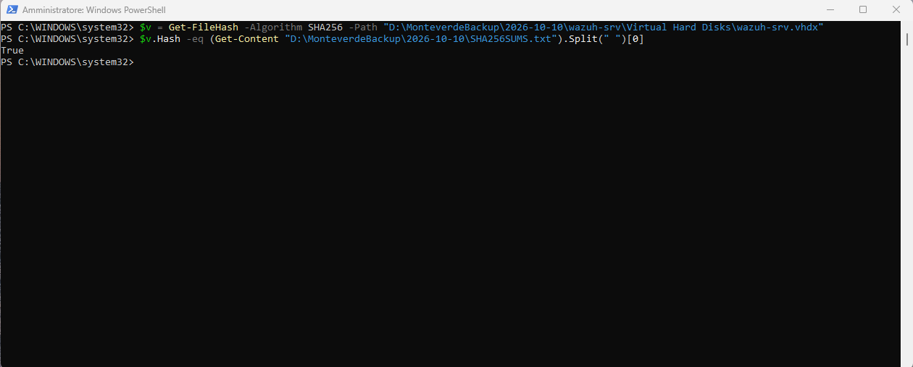
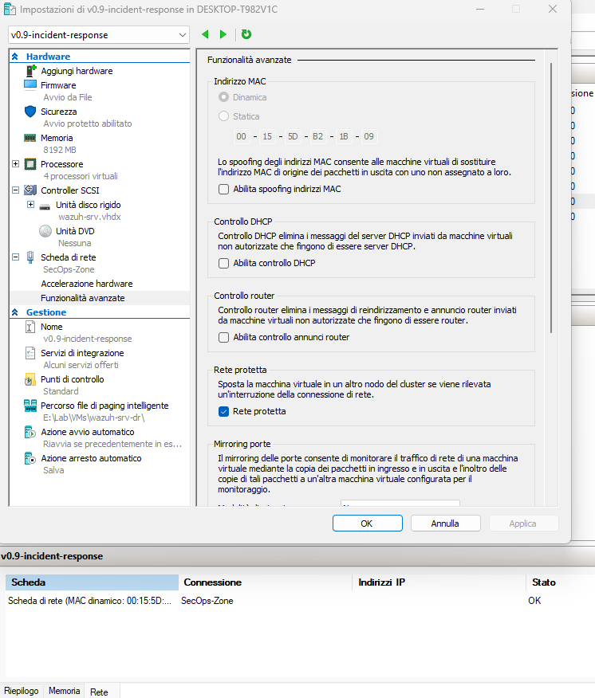
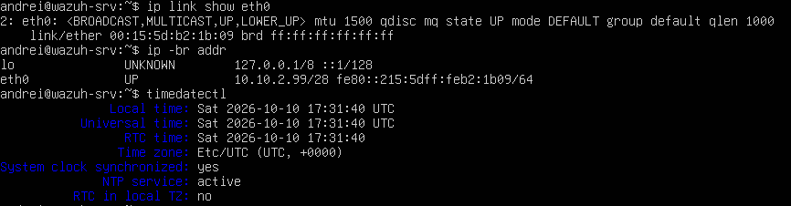
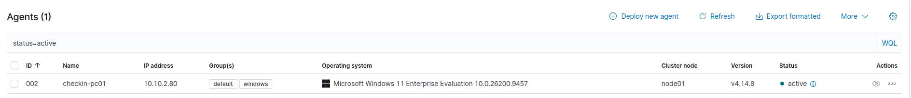

# Monteverde Airport – Disaster Recovery Plan and Test Report

**Document ID:** DRP-2026-001 (includes test record DR-TEST-2026-001)
**Scope:** Monteverde Airport simulated IT environment (isolated Hyper-V lab)
**Date:** 2026-10-10
**Owner:** SOC analyst (lab author)
**References:** NIST SP 800-34 Rev. 1 (contingency planning), ISO 22301 (business continuity) – used as structure, not as a certification claim

---

## 1. Purpose

This plan defines how the lab's systems are backed up and recovered after a
disaster, and records the first real recovery test. A recovery plan that has
never been tested is an assumption, not a plan: the test in section 7 is what
turns the targets below into measured facts.

## 2. Key concepts

| Term | Meaning in this plan |
|---|---|
| **RTO** (Recovery Time Objective) | Maximum acceptable time from declaring the disaster to the service working again |
| **RPO** (Recovery Point Objective) | Maximum acceptable data loss, measured as the age of the most recent backup at the time of the disaster |
| **Backup** | A copy stored on **separate media**, independent of the original system |
| **Checkpoint** | A Hyper-V point-in-time state stored **next to the VM on the same disk**. Useful for rollback, **not a backup** |

**Why checkpoints are not backups:** checkpoint files (`.avhdx`) live on the
same physical disk as the VM. If that disk fails, is encrypted by ransomware,
or the VM folder is deleted, the VM and all its checkpoints are lost together.

## 3. Systems and recovery status

| System | Role | Criticality | Offline backup | Recovery tested |
|---|---|---|---|---|
| `fw-monteverde` | Firewall, gateway, DNS, NTP | High (all traffic depends on it) | No | No |
| `checkin-srv` | Check-in vendor system | High (core business service) | No | No |
| `wazuh-srv` | SIEM | High (security visibility) | **Yes** | **Yes (2026-10-10)** |
| `checkin-pc01` | Check-in operator workstation | Medium | No | No |
| `mon-srv` | Monitoring (Prometheus/Grafana) | Medium | No | No |
| `soc-ws01` | SOC analyst workstation | Medium | No | No |

Only the SIEM was backed up and tested in this version. Extending the same
procedure to every system is a planned action (risk R-14 in the risk register).

## 4. Recovery objectives (SIEM)

| Objective | Target | Rationale |
|---|---|---|
| RTO | **60 minutes** | An airport cannot stay without security monitoring for long, especially during an incident |
| RPO | **24 hours** | Assumes one backup per day (nightly) |

Targets were set **before** the test, so the result could not be adjusted to fit them.

**Honest note:** the 24-hour RPO is only valid if a backup is taken every day.
In this lab the backup is a manual, one-off operation; it is not scheduled yet.

## 5. Backup strategy (3-2-1 rule)

The industry reference is the **3-2-1 rule**: 3 copies of the data, on 2
different types of media, with 1 copy off-site / offline.

| Copy | Location | Status |
|---|---|---|
| 1. Production | VM disk on the lab SSD (E:) | ✅ |
| 2. Checkpoints | Same lab SSD (E:) | ⚠️ Same disk – not independent |
| 3. Offline backup | External USB disk, disconnected after the backup | ✅ |

**Result:** the offline copy is in place (this is the copy ransomware cannot
reach while it is disconnected). The off-site requirement is **not** met: the
external disk is kept in the same building as the lab. Documented as a limitation.

## 6. Procedures

### 6.1 Backup procedure

1. Export the last known-good checkpoint (Hyper-V Manager → checkpoint →
   **Export**) to a dated folder on the external disk:
   `<backup-disk>\MonteverdeBackup\YYYY-MM-DD\`.
   Exporting a single checkpoint merges the checkpoint chain into **one** clean
   virtual disk.
2. Compute the SHA-256 hash of the exported disk and store it in `SHA256SUMS.txt`:
   ```powershell
   $h = Get-FileHash -Algorithm SHA256 -Path "<backup-folder>\wazuh-srv\Virtual Hard Disks\wazuh-srv.vhdx"
   Set-Content -Path "<backup-folder>\SHA256SUMS.txt" -Value "$($h.Hash)  wazuh-srv.vhdx"
   ```
3. Record the hash in a **second, separate place** (this document). A hash
   stored only next to the backup can be altered together with the backup.
4. Eject and disconnect the external disk.

### 6.2 Recovery procedure (runbook, revised after the test)

Steps marked **[revised]** were added or changed because of problems found in
the test (section 7).

1. **Declare the disaster** and start a **written timeline** (time of every step,
   recorded as it happens). **[revised]**
2. Make sure the failed VM is **powered off** and rename it (e.g.
   `wazuh-srv-ORIGINAL`) so two VMs with the same name cannot be confused.
   The two VMs share the same IP address and must never run at the same time.
3. Use a recovery console with **QuickEdit mode disabled**, and do not
   interact with it during long operations. **[revised]**
4. **Verify backup integrity before using it:**
   ```powershell
   $v = Get-FileHash -Algorithm SHA256 -Path "<backup-folder>\wazuh-srv\Virtual Hard Disks\wazuh-srv.vhdx"
   $v.Hash -eq (Get-Content "<backup-folder>\SHA256SUMS.txt").Split(" ")[0]
   ```
   Continue only if the result is `True`.
5. **Prepare the destination folder in advance** (e.g. `E:\Lab\VMs\wazuh-srv-dr\Virtual Hard Disks\`). **[revised]**
6. Import the VM with **"Copy the virtual machine (create a new unique ID)"**.
   Never "register in place": running the VM directly from the backup would
   modify the only clean copy.
7. If the imported VM is in **Saved** state, **delete the saved state before the
   first start**, so the VM performs a clean boot. **[revised – not yet tested]**
   A VM resumed from a saved state keeps its old MAC address and old clock
   (see 7.4).
8. Start the VM and verify, inside the guest:
   - `ip link show eth0` → MAC matches the one assigned by Hyper-V
   - `ip -br addr` → `10.10.2.99/28`
   - `timedatectl` → **today's date** (check the value, not only "synchronized: yes") **[revised]**
   - `systemctl is-active wazuh-manager wazuh-indexer wazuh-dashboard` → `active` ×3
9. Verify the service end to end:
   - Wazuh dashboard reachable from `soc-ws01`
   - agent `checkin-pc01` **Active**
   - a **new alert** is received (test event: a deliberate failed logon on
     `checkin-pc01`, which raises Wazuh rule 60122)
10. Stop the clock: RTO ends when all three conditions in step 9 are true.

### 6.3 Failback (return to the original system)

In a real disaster the restored VM becomes the new production server. In this
test the disaster was simulated and the original VM held 22 more hours of data,
so the lab failed back to the original:

1. Shut down the restored copy.
2. Rename the original back to `wazuh-srv` and start it.
3. Verify time, agent status and dashboard (if `soc-ws01` cannot reach the
   SIEM, clear its stale ARP entry: `sudo ip neigh flush 10.10.2.99`).
4. Only after the original is confirmed working, delete the restored copy and
   its folder.

Data created during the test window (for example, the test alert at 19:28)
existed only in the restored copy and was discarded with it.

---

## 7. DR test record – DR-TEST-2026-001

### 7.1 Scenario

> *The virtual disk of the SIEM server (`wazuh-srv`) has failed. The airport's
> security monitoring is down. Restore the SIEM from the offline backup.*

All times are local time (CEST, UTC+2) on 2026-10-10.

### 7.2 Backup

| Item | Value |
|---|---|
| Source | Checkpoint `v0.9-incident-response` (created 2026-10-09 20:16) |
| Destination | External USB disk, `MonteverdeBackup\2026-10-10\` |
| Duration | 15:59 → 16:15 (**16 min**) |
| Output | One merged `wazuh-srv.vhdx`, 37,685,821,440 bytes (~35 GiB); original checkpoint chain ≈ 65 GB |
| SHA-256 | `B5FE46EF691CAA140D71659DCA8AEB3D2BC792886A125D8D752847064140E5B6` |



### 7.3 Timeline

**Attempt 1 (T0 16:39) – aborted.** The PowerShell console was paused by
QuickEdit mode after an accidental click inside the window (title bar showed
"Select"). The hash-verification step could not be timed, so the attempt was
declared invalid and restarted. Corrective action: QuickEdit disabled on the
recovery console (runbook step 3).

**Attempt 2:**

| Time | Event | Duration |
|---|---|---|
| 18:36 | **T0** – disaster declared | – |
| 18:51 | Backup integrity verified (`True`) | 15 min |
| ≈19:11 | Import finished (VM configuration files written) | ≈20 min |
| 19:15 | Restored VM started (resumed from saved state) | 4 min |
| 19:15–19:25 | Troubleshooting: restored SIEM unreachable, clock one day behind | 10 min |
| 19:25 | Guest reboot | – |
| 19:28 | New alert received from `checkin-pc01` – **end of RTO** | 3 min |

The end time of the import is approximate: it is derived from the timestamps of
the VM configuration files, because Hyper-V does not display it. The `.vhdx`
kept the original backup timestamp (16:14), so it could not be used.

### 7.4 Issues found

**Issue 1 – restored SIEM isolated from the network.**
`soc-ws01` could not reach `10.10.2.99` (ping 100% loss, ARP entry `FAILED`).
Inside the VM the interface was `UP` with the correct IP.

*Root cause:* the checkpoints are of type **Standard**, which also saves the
VM's memory. The restored VM **resumed from that memory** and kept using the
original VM's MAC address (`00:15:5D:B2:1B:07`), while Hyper-V had assigned the
imported copy a new dynamic MAC (`00:15:5D:B2:1B:09`). Hyper-V's virtual switch
drops frames whose source MAC is not the one assigned to the VM (MAC address
spoofing is disabled), so all traffic was silently discarded.

*Evidence:* the IPv6 link-local address changed from `fe80::215:5dff:feb2:1b07`
to `fe80::215:5dff:feb2:1b09` after the reboot. The link-local address is
derived from the MAC (EUI-64), which proves the MAC in use before the reboot.

*Fix chosen:* reboot the guest so it reads the MAC actually assigned by Hyper-V.
Rejected alternatives: enabling MAC spoofing (disables a security control for
convenience); assigning the old MAC statically (it belongs to the original VM –
duplicate MAC address if both ever run).



**Issue 2 – SIEM clock one day behind.**
After resuming, the VM clock showed 2026-10-09 18:13 UTC (≈23 hours behind),
while `timedatectl` still reported `System clock synchronized: yes` – a status
restored from memory, not a fresh synchronisation (NTP could not work without
network). A SIEM with the wrong time records alerts on the wrong day and breaks
time-based searches and correlation. Fixed by the same reboot.



### 7.5 Results

| Objective | Target | Measured | Result |
|---|---|---|---|
| RTO | 60 min | **52 min** | ✅ Met (8 min margin) |
| RPO | 24 h | **22 h 20 min** (backup 2026-10-09 20:16 → disaster 2026-10-10 18:36) | ✅ Met |
| Backup integrity | Hash match | `True` | ✅ |
| Service verification | Dashboard + agent + new alert | All three | ✅ |




**Assessment:** the objectives were met, but narrowly. 10 of the 52 minutes
were spent diagnosing a problem that the revised runbook avoids (step 7).
Without that delay the recovery would have taken about **40 minutes**.

---

## 8. Corrective actions

| # | Action | Linked risk | Status |
|---|---|---|---|
| 1 | Switch VM checkpoints from **Standard** to **Production** (no memory state) | R-15 | Planned |
| 2 | Delete saved state before first start of a restored VM (runbook step 7) | R-15 | Documented, not yet tested |
| 3 | Back up all VMs to the offline disk, not only the SIEM | R-14 | Planned |
| 4 | Make the backup a scheduled daily task, so the 24 h RPO is real | R-14 | Planned |
| 5 | Keep a second backup copy off-site | R-14 | Planned |
| 6 | Disable QuickEdit on recovery consoles; keep a written timeline during recovery | – | Done (runbook) |
| 7 | Prepare recovery folders in advance | – | Done (runbook) |

## 9. Known limitations

- Only one system (the SIEM) was backed up and tested.
- Backups are manual; no schedule, no automation, no retention policy yet.
- No off-site copy: the offline disk is stored in the same place as the lab.
- The backup was exported from a **running** VM's Standard checkpoint, so it
  contained memory state – the direct cause of both issues in section 7.4.
- Runbook step 7 (delete saved state) is a documented improvement that has
  **not been tested yet**.
- The restored VM ran on the same Hyper-V host and the same lab disk. A real
  disaster could also take out the host; recovery onto different hardware was
  not tested.

## 10. Lessons learned

1. **A checkpoint is not a backup.** Only a copy on separate, disconnected media
   survives disk failure or ransomware.
2. **Test the restore, not just the backup.** The backup itself worked perfectly;
   both problems appeared only during recovery.
3. **Verify values, not status flags.** `synchronized: yes` was true in memory
   and false in reality.
4. **The operator is part of the system.** A single accidental click froze the
   recovery console; the runbook now protects against it.
5. **A failed or imperfect test is a result.** Every issue found here was found
   in a drill, not during a real outage.

## 11. Review

This plan is reviewed after every DR test and whenever a system is added or
changed. Next test: after the corrective actions in section 8 (in particular
Production checkpoints and runbook step 7).
